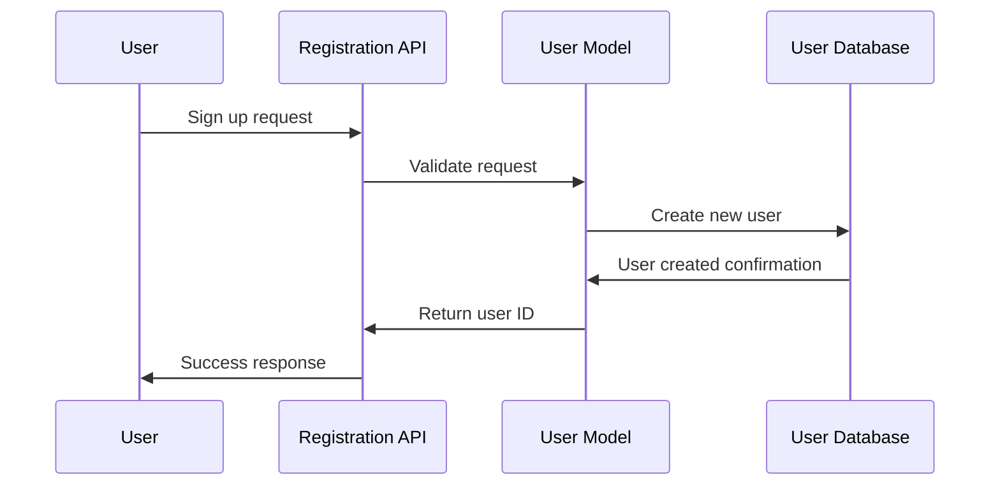

```mermaid
sequenceDiagram
    participant User
    participant RegistrationAPI as Registration API
    participant UserModel as User Model
    participant UserDatabase as User Database

    User ->> RegistrationAPI: Sign up request
    RegistrationAPI ->> UserModel: Validate request
    UserModel ->> UserDatabase: Create new user
    UserDatabase ->> UserModel: User created confirmation
    UserModel ->> RegistrationAPI: Return user ID
    RegistrationAPI ->> User: Success response
```
