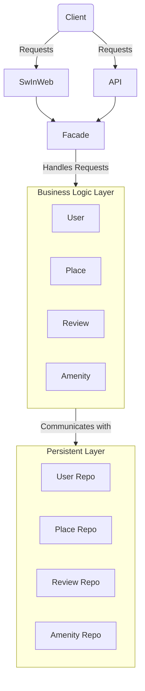

```mermaid
graph TD
    Client(Client) -->|Requests| SwInWeb[SwInWeb]
    Client -->|Requests| API[API]

    SwInWeb --> Facade[Facade]
    API --> Facade

    Facade -->|Handles Requests| BusinessLogicLayer[Business Logic Layer]

    subgraph BusinessLogicLayer[Business Logic Layer]
        User[User]
        Place[Place]
        Review[Review]
        Amenity[Amenity]
    end

    BusinessLogicLayer -->|Communicates with| PersistentLayer[Persistent Layer]

    subgraph PersistentLayer[Persistent Layer]
        UserRepo[User Repo]
        PlaceRepo[Place Repo]
        ReviewRepo[Review Repo]
        AmenityRepo[Amenity Repo]
    end
```
