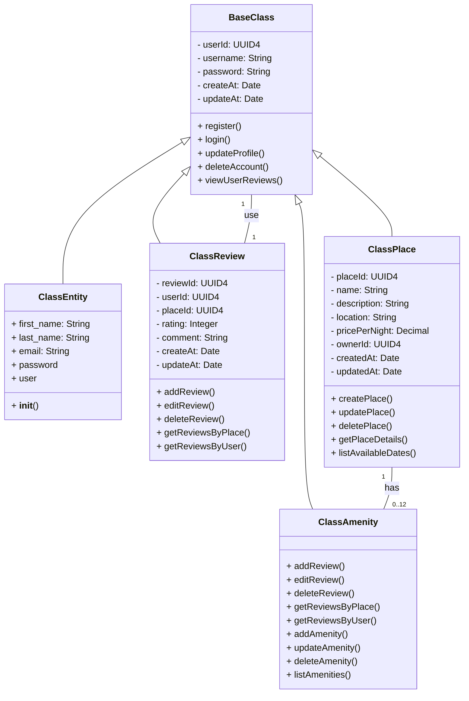

```mermaid
classDiagram
    class BaseClass {
        - userId: UUID4
        - username: String
        - password: String
        - createAt: Date
        - updateAt: Date
        + register()
        + login()
        + updateProfile()
        + deleteAccount()
        + viewUserReviews()
    }

    class ClassEntity {
        + first_name: String
        + last_name: String
        + email: String
        + password
        + __init__()
        + user
    }

    class ClassReview {
        - reviewId: UUID4
        - userId: UUID4
        - placeId: UUID4
        - rating: Integer
        - comment: String
        - createAt: Date
        - updateAt: Date
        + addReview()
        + editReview()
        + deleteReview()
        + getReviewsByPlace()
        + getReviewsByUser()
    }

    class ClassPlace {
        - placeId: UUID4
        - name: String
        - description: String
        - location: String
        - pricePerNight: Decimal
        - ownerId: UUID4
        - createdAt: Date
        - updatedAt: Date
        + createPlace()
        + updatePlace()
        + deletePlace()
        + getPlaceDetails()
        + listAvailableDates()
    }

    class ClassAmenity {
        + addReview()
        + editReview()
        + deleteReview()
        + getReviewsByPlace()
        + getReviewsByUser()
        + addAmenity()
        + updateAmenity()
        + deleteAmenity()
        + listAmenities()
    }

    %% Relationships
    BaseClass <|-- ClassEntity
    BaseClass <|-- ClassReview
    BaseClass <|-- ClassPlace
    BaseClass <|-- ClassAmenity
    ClassPlace "1" -- "0..12" ClassAmenity : has
    BaseClass "1" -- "1" ClassReview : use
```
